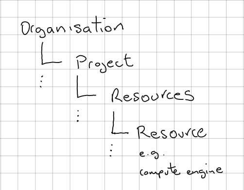
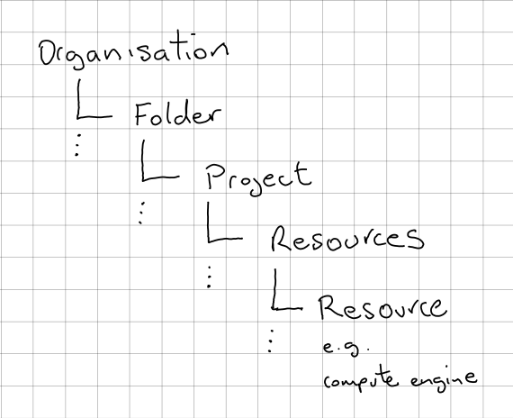

Growing pains on Google Cloud
=============================

[picture of tidy tools laid out nicely]
What I'd like

[picture of disorganised tools]
What I have now

As a startup grows it builds and iterates quickly. For my company this meant our Google Cloud layout had grown organically rather then being planned. Cracks had begun to show. It was hard to manage the firewalls across many projects. Servers and services were available publically when there was no need to be. People had privileges they did not need to have. I needed to take a step back. How would I lay out Google Cloud if I started again? How would I then migrate from where I am to the approach I want to take.

Requirements:
- A single place to manage the Firewall, Network and Routing.
- Virtual machines to be private and not public by default.
- Staff with only the permssions needed for their day to day work.
- Freedom to use Resouces at the Project level but in a safe manner.
- To know about vunerabilities and problems on my cloud.
- Versioning and management of my configuration with Terraform.

I've done a lot of reading and experimenting with Google Cloud over the past few years. Finding the right thing in Google's documentation can be tricky. I'm going to explain the useful things I've learned and on the journey to my approach.

Key concepts to know:

- `Google Cloud Resources Hierarchy`_
- `Google Cloud Identity and Access Management (IAM)`_
- `Configuration Management with Terraform`_
- `Shared Virtual Private Cloud (VPC)`_

My approach:

- `Configuration Management with Terraform`_
- Security
- Staff, Groups & IAM
- Shared VPC

Google Cloud Resources Hierarchy
--------------------------------

The Resources Hierarchy is how Google Cloud organises access to resources. The hierarchy is similar to arranging files on a computer. Only the files here represent for example Compute Engine or BigQuery. The Organisation represents the root or top of the "file system". Each directory in the "file system" tree can have access rights and permissions set on it. In my case the next level down from Organisation will be Projects. Beneath each project comes the individual Resources.

At each level in the Resources Hierarchy you can set access controls and configuration. All controls and configuration are inherited down from the point they are set. For example if a user is given Administrator rights over Compute Engine at the Organisational level, they will have the same rights all the way down. However, if they only have Administrator rights at a project level, they will not be able to control other Project's Compute Engine.

Technically there is another level between Organisation and Projects. These are called Folders. They are used to mirror your corporate structure. As a small company I don't need this yet. You can read more about using Folders here https://cloud.google.com/resource-manager/docs/creating-managing-folders.

For an indepth dive into this have a look at Google's documentation here https://cloud.google.com/resource-manager/docs/cloud-platform-resource-hierarch.

Google Cloud Identity and Access Management (IAM)
-------------------------------------------------

With Cloud IAM you control who has what access to which resources. IAM uses a Role Based Access Control system applied at points in the Resource Hierarchy. The "who" is also known as the identity. The identity is granted one or more roles. The roles an identity holds at a point in the hierarchy determine what it can do. I'm not going to give an in-depth dive into all IAM abilties and functionality. I'm just going to cover what I and probably most people need day to day.

A role is made up of individual granular permissions. The permissions control small pieces of behaviour. For example "bigquery.tables.get" permission allows you to get information about a table in BigQuery, but not the data in the table. Just having this permssion is not very useful on its own. It is the grouping of these small permissions into roles which gives power and fine grained control. Google has three type of Roles. Primitive, Predefined and Custom Roles. I haven't needed to use custom roles and so will ignore this here.

The Primitive roles are called the Owner, Editor and Viewer. Viewer gives read-only abilities that don't modify data. Editor allows limited modification and Owner grants full abilities. Having the Owner role means you also have the Editor and Viewer abilities. Having the Editor means you also have the Viewer Abilities. These roles get you going faster, however they can give broad abilities that may not be needed.

Predefined roles have a narrower focus then Primitive ones. They allow you to restrict access to a limited set of abilities. For example to allow someone limited useful "read-only" access to BigQuery. You give a user the roles "roles/bigquery.jobUser" to run queries and "roles/bigquery.dataviewer" to see the results of the queries and data from the tables.

The final bit of IAM is the creation of a Policy. A policy is made up of at least one Member and one Role which is applied to a Resource. Google calls this a policy a binding of members to roles. The policy Member can be a variety of things. It can be a Gmail Account, GSuite Domain Account, Cloud Identity Account. In this case it will be the individual end user's email address. There are also the special members Service Account or Google Group. Service account is a special type of account for computers rather then humans. A Google Group is a way to give a group of people one or more roles rather then binding the individual accounts to the roles. Service Accounts and Google Groups also have email addresses and these are used in the binding.

We use GSuite for our business and each staff member has an account on it. Our main domain is also set up as an Organisation in Google Cloud. Google knows about the link between GSuite and Google Cloud. I can assign staff members to Google Groups and bind those groups to specific predefined roles.

Google has some very indepth documentation on IAM. To go deeper into how it works beyond what I've talked about I would recommend reading:

- https://cloud.google.com/iam/docs/overview
- https://cloud.google.com/iam/docs/understanding-roles

TIP: When reading Google documentation, you will often find it mentions individual permissions for fuctionality you might need. How do you find the role which could give you this? I find this page very helpful for this:

- https://cloud.google.com/iam/docs/permissions-reference

Simply perform a page search for the permission to see which roles have the permssion.

Configuration Management with Terraform
---------------------------------------

Configuration management is the ability to automatically create or recreate your infrastructure from code. Configuring your infrastructure manually, while easier initially, quickly leads to many downsides. Chief amongst there are the difficultly of recreating your set up in case of accident or disaster. The knowledge may have left the business when you need it most.

I choose `Terraform <https://www.terraform.io/docs/index.html>`_ as my configuration management tool. The tool is less important then the ability to recreate your infrastructure from code. There are many other tools out there to choose from. Whether you starting from scratch or some time later, it is worth investing the time it takes to do the Terraform set up. Its never too late to use configuration management!

Shared Virtual Private Cloud (VPC)
----------------------------------

I want to have a single place to control the firewall, networking and routing. Google Cloud Shared VPC provide this functionality.

